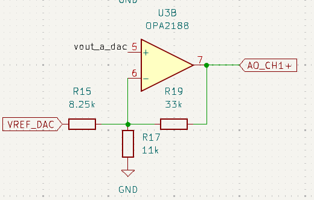

# 8CH DAC Board (16 bits)

Many times we need to obtain an analog signal from an embedded system. In these cases we will need a digital to analog converter. This board features two 4 channel digital to analog converters with a resolution of 16 bits. 

The output voltage of the board has a range from -10 volt to 10 volts qith a supply voltage of +-12V.

## Analog output

The DAC used in this board is the [DAC80004](https://www.ti.com/product/es-mx/DAC80004), a 4 channel, 16 bits DAC from Texas Instruments. This DAC is footprint compatible with DAC70004 (14 bits), and DAC60004 (12 bits).

To obtain the bipolar output, a simple circuit with just one amplifier is used. 

## Voltage reference

For the output range of +-10V, we will need a voltage reference of 2.5 volts. We can reduce the output range, and therefore increase the resolution in volts by using a reference of 1.024 volts or 1.250.

The reference used is the REF5020 with soma capacitors for fixeliminate the noise in the output voltage.

## Connectors

The conenctor are the only component in the bottom side of the board. The board uses three connectors, one for the control of the DAC, and two for the output voltages.

## Layout

The layout of the board is 35mm x 50mm. Several VCC planes and GND planes are used in the board to share the power supplies.

## Get Yours

This DAC Board is open-source, so you can use the output files to build your own in [JLCPCB](https://jlcpcb.com/?from=controlpath). You just need to compress the `gerber` directory, and upload it to [JLCPCB](https://jlcpcb.com/?from=controlpath). 

Remember to change the Surface Finish to **LeadFree HASL** to make your board ROHS compliant.

Then you have to add the PCB Assembly service and upload the [centroid](./kicad/production_files/dac16bit_8ch-all-pos.csv) file, and the [BOM](./kicad/production_files/bom.csv). 